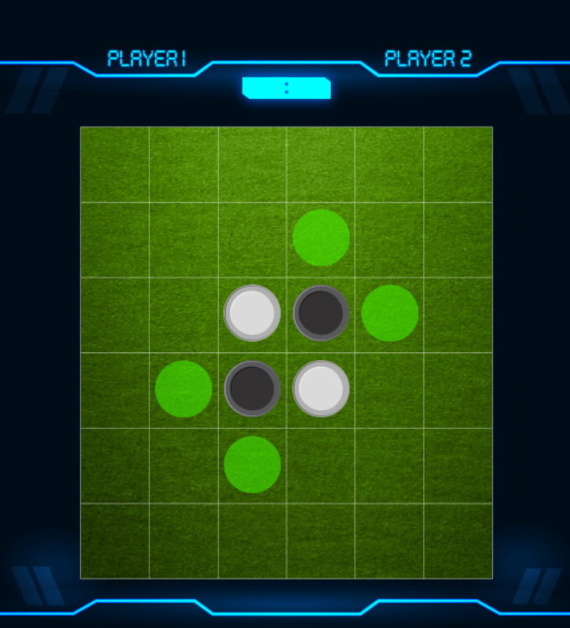

# CSharp
C# Projects

<b>Reversi - Windows application with graphical interface!</b> 
<ul>
          <li><b>Two game option:</b> Play against another player or against computer</li>
          <li><b>AI Computer:</b> Computer using Alpha-beta algorithm</li>
</ul>

<b>Garage Manager - Simple console application</b> 
Helps to manage a garage: 
<ul>
  <li>Using data structures likes Dictionary to to transfer different types of variables (using the concept of inherit from Object)</li>
  <li>Option to add new vehicle type without changing the rest of the system components (Adding only call to c'tor of new vehicle)</li>
</ul>
